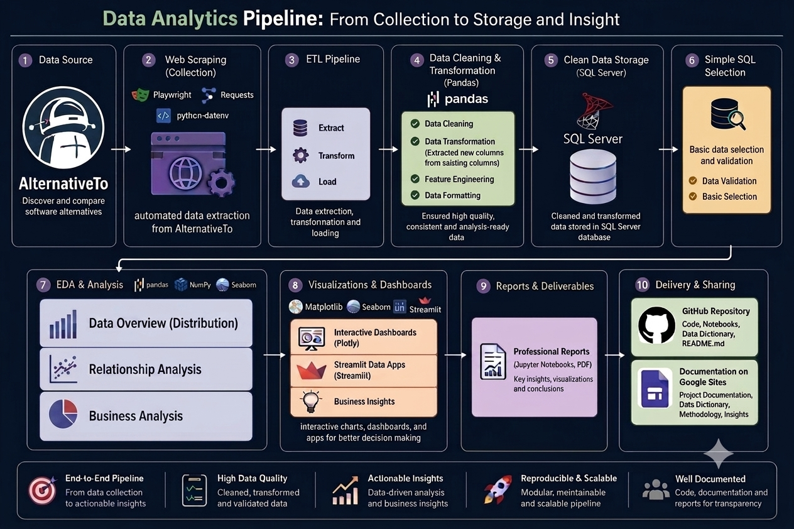

  
# Comparative Analysis of Software Alternatives Using AlternativeTo Data
  

## 🔍 Project Overview
This project focuses on comparing and analyzing software alternatives using data collected from the AlternativeTo website.         
It aims to analyze the distribution of software applications across categories, licensing models, supported platforms, languages, and countries of origin, providing a comprehensive understanding of the software ecosystem.          
The project helps developers, companies, researchers, and end users compare software alternatives and make informed decisions when selecting software solutions.
## 🎯 Objectives 

## 🏗️ Architecture Overview

## 🗃️ Dataset
The dataset was collected from the AlternativeTo website through web scraping and contains detailed information about software applications.   
It includes attributes such as application name,Cost,app_type,supported_languages,origin ... etc
- **Source:** AlternativeTo Website
- **Collection Method:** Web Scraping
- **Format:** CSV
- **Records:** 3712  software applications
- **Features:** 16 columns

## 🛠️ Technology Stack
| Category | Technology |
|:---------|:-----------|
| Programming Language | Python |
| Development Environment | Jupyter Notebook |
| Data Collection | Playwright, requests, python-dotenv| 
| Data Manipulation | Pandas, NumPy ,pycountry_convert ,pyodbc|
| Data Visualization | Matplotlib, Seaborn , Plotly ,streamlit |
| Data Storage | SQL Server |

## 🖥️ Dashboard Preview

## 💡 Results & Insights

## 🚀 Recommendations 
   ##### 1- Evaluate market competition before selecting an application category; highly competitive categories require clear differentiation.
   ##### 2- Align the pricing model with the target platform (Web/Mobile → Free or Freemium, Desktop → Pay Once).
   ##### 3- Choose the licensing model based on business goals (Open Source for wider adoption, Proprietary for direct revenue).
   ##### 4- Support multiple languages to increase market reach and gain a competitive advantage.
   ##### 5- Consider regional market differences when targeting users, as application preferences vary across geographic regions.

## 👥 Team Members
| Member_Name | Responsibilities |
|:---------|:-----------|
| **Rahma Ahmed** | • Web Scraping   • EDA & Analysis    • Data Visualization   • Project Documentation    • Discussion Presentation |
| **Faten Ahmed** | • Team Leader   • Data Cleaning    • EDA & Analysis   • Data Visualization    • Data Storage (SQL Server)   • Github.README.md    • Discussion Presentation |
| **Rahma Mohammed**| • Statistical Analysis   • EDA & Analysis |
