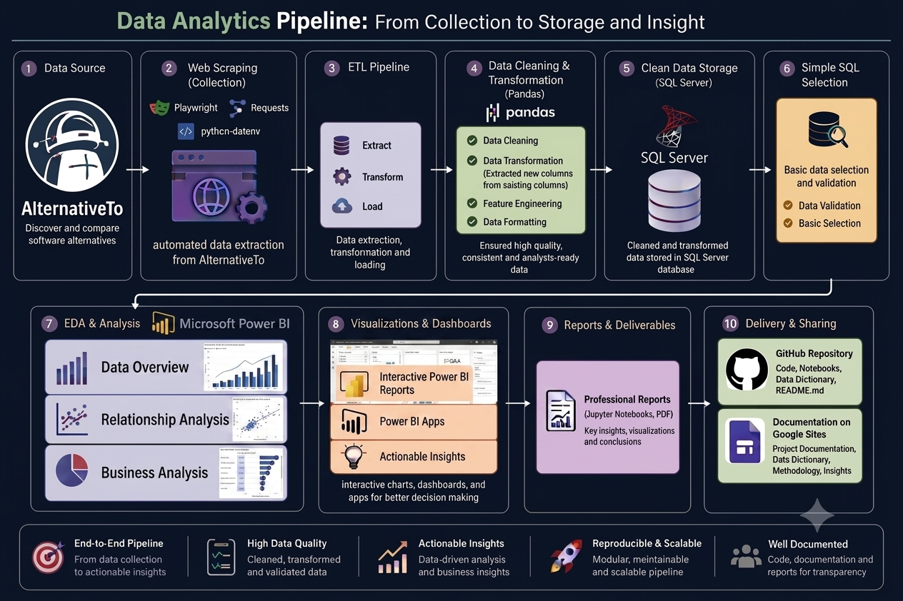

  
# Comparative Analysis of Software Alternatives Using AlternativeTo Data
  

## 🔍 Project Overview
This project focuses on comparing and analyzing software alternatives using data collected from the AlternativeTo website.         
It aims to analyze the distribution of software applications across categories, licensing models, supported platforms, languages, and countries of origin, providing a comprehensive understanding of the software ecosystem.          
The project helps developers, companies, researchers, and end users compare software alternatives and make informed decisions when selecting software solutions.
## 🎯 Objectives 
- Analyze the distribution of software pricing models and licensing types.
- Explore the relationship between pricing strategies and license models.
- Examine platform and operating system preferences across applications.
- Identify geographic patterns in software development.
- Compare pricing trends across desktop operating systems (Windows, macOS, and Linux)
- Analyze the popularity of different application categories.
- Generate actionable insights to support developers and business decision-makers.
## 🏗️ Architecture Overview
 
## 🗃️ Dataset
The dataset was collected from the AlternativeTo website through web scraping and contains detailed information about software applications.   
It includes attributes such as application name,Cost,app_type,supported_languages,origin ... etc
- **Source:** AlternativeTo Website
- **Collection Method:** Web Scraping
- **Format:** CSV
- **Records:** 3712  software applications
- **Features:** 16 columns

## 🛠️ Technology Stack
| Category | Technology |
|:---------|:-----------|
| Programming Language | Python |
| Development Environment | Jupyter Notebook |
| Data Collection | Playwright, requests, python-dotenv| 
| Data Manipulation | Pandas, NumPy ,pycountry_convert ,pyodbc|
| Data Visualization | Power BI |
| Data Storage | SQL Server |

## 💡 Results & Insights
📌 Application Categories :- 

The analysis shows that AI Chatbots are the most common application category, with 127 applications, followed by Note-Taking applications (89) and To-Do List Managers (72). This indicates that AI Chatbots represent a highly competitive segment of the market. Developers planning to build AI chatbot applications should consider offering unique features or a clear value proposition to stand out. In contrast, less crowded categories, such as AI Writing Tools (70 applications), may provide opportunities for entering the market with lower competitive pressure.

💰 Pricing & Licensing :-

The analysis shows that Free and Freemium are the dominant pricing models, while Paid applications represent only a small portion of the market. This suggests that free and low-cost pricing strategies are the most widely adopted in the software industry. In addition, Free applications are predominantly associated with Open Source licenses, whereas paid models are more commonly linked to Proprietary licenses, indicating a clear relationship between licensing models and pricing strategies.

🖥️ Platforms :-

The analysis reveals that Web is the most widely supported platform, followed by Desktop and Mobile. Among desktop operating systems, macOS has the highest number of supported applications, followed by Windows and Linux. Furthermore, Free and Freemium pricing models are the most common on both macOS and Linux, suggesting that platform choice is closely associated with software pricing strategies.

🌍 Geographic Distribution :-

The analysis shows that software development is primarily concentrated in North America and Europe. At the country level, the United States leads with 876 applications, followed by the United Kingdom and Germany. In terms of application categories, AI applications dominate in North America and Asia, while Productivity applications are the most prevalent in Europe and South America. These findings suggest that developers should consider regional market preferences when selecting their target market, as software demand and application trends vary across geographic regions.

## 🚀 Recommendations 
   ##### 1- Evaluate market competition before selecting an application category; highly competitive categories require clear differentiation.
   ##### 2- Align the pricing model with the target platform (Web/Mobile → Free or Freemium, Desktop → Pay Once).
   ##### 3- Choose the licensing model based on business goals (Open Source for wider adoption, Proprietary for direct revenue).
   ##### 4- Support multiple languages to increase market reach and gain a competitive advantage.
   ##### 5- Consider regional market differences when targeting users, as application preferences vary across geographic regions.

## 👥 Team Members
| Member_Name | Responsibilities |
|:---------|:-----------|
| **Rahma Ahmed** | • Web Scraping   • EDA & Analysis      • Project Documentation    |
| **Faten Ahmed** | • Team Leader   • Data Cleaning    • EDA & Analysis   • Data Visualization    • Data Storage (SQL Server)   • Github.README.md    • Discussion Presentation |
| **Rahma Mohammed**| • EDA & Analysis |
